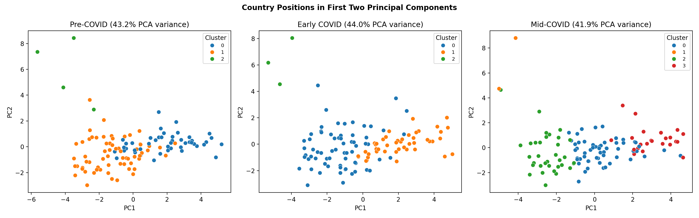

# Clusters in Crisis

**Author:** Christian Regie Jabagat

This independent exploratory project studies how countries grouped by economic,
social, health, finance, and education indicators before and during COVID-19. It
uses World Bank World Development Indicators for 2019, 2020, and 2021, then
compares country clusters across three periods:

- 2019: Pre-COVID
- 2020: Early COVID
- 2021: Mid-COVID



## Research Question

To what extent did countries retain their pre-pandemic development peer groups,
and to what extent did they move into new structural groupings during 2020 and
2021?

## Method

The analysis filters selected WDI indicators, removes regional and income-group
aggregates, keeps a complete country-year panel, standardizes features within
each year, and compares country groupings using hierarchical clustering. K-Means
and OPTICS are included as reference models.

Cluster movement is evaluated with Adjusted Rand Index, Normalized Mutual
Information, pairwise co-membership Jaccard, and cluster-to-cluster Jaccard
overlap. These measures compare partitions without assuming that numeric cluster
labels are consistent across separate yearly clustering runs.

## Key Results

- The complete-panel analysis retains 115 countries and 18 WDI indicators.
- Cluster structure is moderately stable from 2019 to 2020, with pairwise
  co-membership Jaccard of 0.539.
- Stability weakens by 2021, with pairwise co-membership Jaccard around 0.377
  for 2019-2021 and 0.374 for 2020-2021.
- OPTICS collapses to one usable cluster under the selected configuration, so it
  is treated as a reference result rather than the main clustering model.

## Files

- `EconClustering_ExploratoryAnalysis.ipynb`: exploratory notebook.
- `src/econ_clustering/pipeline.py`: reusable analysis pipeline.
- `scripts/run_analysis.py`: command-line analysis runner.
- `scripts/download_wdi.py`: WDI data download helper.
- `outputs/analysis_summary.md`: summary of retained data and stability
  metrics.
- `outputs/tables/`: cleaned panel, cluster labels, validation metrics,
  transition tables, and mobility summaries.
- `outputs/figures/`: PCA, transition, Jaccard, missingness, and profile
  figures.

## Reproduce the Analysis

Create an environment and install dependencies:

```bash
python -m venv .venv
source .venv/bin/activate
pip install -r requirements.txt
```

Download the WDI data if `WDICSV.csv` is not already present:

```bash
python scripts/download_wdi.py --output-dir .
```

Run the analysis:

```bash
python scripts/run_analysis.py --data WDICSV.csv --output outputs
```

## Outputs

- `outputs/analysis_summary.md`: main analysis summary.
- `outputs/tables/clean_panel.csv`: final complete country-year feature panel.
- `outputs/tables/data_quality_summary.csv`: retained rows,
  countries, years, and features.
- `outputs/tables/clusters_2019.csv`, `clusters_2020.csv`, `clusters_2021.csv`:
  country-level cluster assignments.
- `outputs/tables/cluster_transitions.csv`: country cluster movement over time.
- `outputs/tables/partition_stability_metrics.csv`: label-invariant stability
  metrics across periods.
- `outputs/tables/cluster_validation_metrics.csv`: internal validation metrics
  for hierarchical clustering, K-Means, and OPTICS.
- `outputs/tables/country_mobility_typology.csv`: peer-retention typology for
  country movement across periods.
- `outputs/tables/cluster_profile_summary.csv`: cluster-size,
  example-country, and top-feature summaries.
- `outputs/figures/cluster_transition_heatmap.png`: visual transition overview.
- `outputs/figures/pca_cluster_scatter.png`: PCA cluster scatter plots.
- `outputs/figures/cluster_jaccard_heatmap.png`: cluster membership similarity.
- `outputs/figures/feature_missingness.png`: selected-indicator missingness.
- `outputs/figures/country_mobility_typology.png`: country mobility counts.
- `outputs/figures/top_cluster_features.png`: strongest above-average cluster
  features.

## Data

The raw `WDICSV.csv` file is not tracked because of its size. It can be
recreated from the World Bank WDI CSV archive:

```bash
python scripts/download_wdi.py --output-dir .
```

## Interpretation

The results should be read as exploratory evidence of structural similarity and
movement among countries. The analysis does not estimate causal effects of the
COVID-19 pandemic or specific policy interventions.
